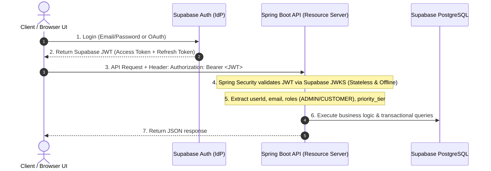

# TicketForge: Architecture, Potential Analysis & Modernization Blueprint

**Project Name:** TicketForge  
**GitHub Repository:** `ticket-forge`  
**Document Version:** 2.2.0  
**Target Platform:** Java 21 LTS | Spring Boot 3.3.x | Supabase Auth (OAuth2) | Spring Data JPA | Supabase PostgreSQL 16 & H2 | Flyway | JUnit 5 | Maven | Docker | Fly.io / Render  
**Domain:** High-Concurrency Event Ticketing & Priority-Based Resource Allocation Engine  

---

## Table of Contents
1. [Executive Summary & Potential Assessment](#1-executive-summary--potential-assessment)
2. [Current Architecture vs. Target Enterprise Architecture](#2-current-architecture-vs-target-enterprise-architecture)
3. [Deep-Dive: Core Java & Enterprise Concepts](#3-deep-dive-core-java--enterprise-concepts)
4. [Authentication, Authorization & Role Hierarchy (Supabase Auth)](#4-authentication-authorization--role-hierarchy-supabase-auth)
5. [Domain Model, JPA & Flyway Migration Architecture](#5-domain-model-jpa--flyway-migration-architecture)
6. [Concurrency, Thread Safety & Race Conditions](#6-concurrency-thread-safety--race-conditions)
7. [RESTful API Specification & RBAC Matrix](#7-restful-api-specification--rbac-matrix)
8. [Multi-Environment Deployment Strategy (Dev, Preprod, Prod)](#8-multi-environment-deployment-strategy-dev-preprod-prod)
9. [Comprehensive Testing Strategy (JUnit 5, Mockito & Concurrency)](#9-comprehensive-testing-strategy-junit-5-mockito--concurrency)
10. [Simple, Efficient & Modern UI Design (Glassmorphism SPA + SSE)](#10-simple-efficient--modern-ui-design-glassmorphism-spa--sse)
11. [Advanced Enterprise Enhancements](#11-advanced-enterprise-enhancements)
    * 11.1 Real-Time UI Synchronization (Server-Sent Events / SSE)
    * 11.2 Time-Bound Seat Holding & Auto-Expiry (TTL Mechanism)
    * 11.3 API Idempotency & Duplicate Request Protection
    * 11.4 Interactive API Documentation (OpenAPI 3 / Swagger UI)
    * 11.5 Observability & Metrics (Spring Boot Actuator & Micrometer)
    * 11.6 Containerization & Cloud Deployment (Docker & Fly.io / Render)
12. [Enterprise Maven Configuration (`pom.xml`)](#12-enterprise-maven-configuration-pomxml)
13. [Modern Directory Structure](#13-modern-directory-structure)
14. [Step-by-Step Implementation Roadmap](#14-step-by-step-implementation-roadmap)

---

## 1. Executive Summary & Potential Assessment

### 1.1 Current State
**TicketForge** originates from an algorithm-driven seat reservation and priority waitlist engine. It was developed to solve real-time resource allocation and queue re-balancing using custom, low-level data structures:
* **Custom Red-Black Tree (`RedBlackTree.java`)**: A balanced binary search tree maintaining user-to-seat mappings with guaranteed $O(\log N)$ search, insertion, and deletion complexity.
* **Custom Indexed Min-Heap (`MinHeap.java`)**: A binary min-heap integrated with a hash table index (`userIndexMap`) enabling $O(\log N)$ extraction, $O(1)$ search, and $O(\log N)$ arbitrary priority updates or node removals.
* **Procedural Batch Controller (`GatorTicketMaster.java`)**: A CLI file-reader running sequential text commands (`Initialize`, `Reserve`, `Cancel`, `ExitWaitlist`, `UpdatePriority`, `AddSeats`, `PrintReservations`, `ReleaseSeats`, `Quit`).

### 1.2 Limitations of the Current Codebase
1. **Volatile In-Memory State**: Data disappears when the process terminates; output is limited to text logs.
2. **Lack of Concurrency Controls**: Not thread-safe; cannot handle simultaneous user bookings or flash-sale traffic spikes.
3. **No Modern Build System**: Uses an OS-dependent `makefile` rather than a standard Maven/Gradle lifecycle.
4. **No Automated Testing**: Relies on manual output text comparison rather than unit, integration, and load testing.
5. **Raw Object Types & Lack of Generics**: Low type-safety and frequent runtime casts in `MinHeap.java`.

### 1.3 Strategic Potential as an Enterprise Platform
**TicketForge** models the core mechanics of industry giants like **Ticketmaster, StubHub, and Eventbrite**:
* Managing high-demand ticket sales under strict seat-uniqueness constraints.
* Dynamic waitlist prioritization (VIP status, timestamp tie-breaking).
* Cascading automated re-allocation when reservations are cancelled or new inventory is released.

Converting this codebase into a **Spring Boot 3.x enterprise platform** creates an end-to-end showcase combining advanced algorithms with production-grade backend engineering, Supabase identity management, and cloud resilience.

---

## 2. Current Architecture vs. Target Enterprise Architecture

```
CURRENT ARCHITECTURE (Procedural Batch CLI)
[ input.txt ] ──> [ File Parser ] ──> [ Ticket Engine ] ──> [ output.txt ]
                                             │         │
                                             ▼         ▼
                                     [ RedBlackTree ] [ MinHeap ]
                                       (In-Memory)     (In-Memory)
```

```
TARGET ENTERPRISE ARCHITECTURE (Spring Boot 3 + Supabase + JPA + In-Memory Engine)

 ┌────────────────────────────────────────────────────────────────────────┐
 │            Glassmorphism Web Dashboard (Vanilla JS + SSE Stream)       │
 └───────────────────────────────────┬────────────────────────────────────┘
                                     │ HTTP REST / Server-Sent Events (SSE)
                                     ▼
 ┌────────────────────────────────────────────────────────────────────────┐
 │               Spring Security / OAuth2 Resource Server                 │
 │     Stateless JWT Verification via Supabase JWKS Endpoint (RS256)      │
 └───────────────────────────────────┬────────────────────────────────────┘
                                     │
                                     ▼
 ┌────────────────────────────────────────────────────────────────────────┐
 │                    Spring MVC / REST API Layer                         │
 │     [SeatController]   [ReservationController]   [WaitlistController]  │
 └───────────────────────────────────┬────────────────────────────────────┘
                                     │
                                     ▼
 ┌────────────────────────────────────────────────────────────────────────┐
 │                    Service & Business Logic Layer                      │
 │   ┌────────────────────────────────────────────────────────────────┐   │
 │   │                   TicketForge Core Service                     │   │
 │   └───────────────┬───────────────────────────────┬────────────────┘   │
 │                   │                               │                    │
 │                   ▼                               ▼                    │
 │   ┌───────────────────────────────┐ ┌──────────────────────────────┐   │
 │   │  High-Throughput In-Memory    │ │   Concurrency & Lock Manager │   │
 │   │  Generic DSA Matching Engine  │ │  (Pessimistic / Optimistic)  │   │
 │   └───────────────────────────────┘ └──────────────────────────────┘   │
 └───────────────────────────────────┬────────────────────────────────────┘
                                     │
                                     ▼
 ┌────────────────────────────────────────────────────────────────────────┐
 │               Persistence Layer (Spring Data JPA & Flyway)             │
 │     [SeatRepository]   [ReservationRepository]   [WaitlistRepository]  │
 └───────────────────────────────────┬────────────────────────────────────┘
                                     │
                                     ▼
 ┌────────────────────────────────────────────────────────────────────────┐
 │           Relational Database (H2 Local / Supabase PostgreSQL 16)      │
 │    Managed PgBouncer Connection Pooler (Port 6543 Transaction Mode)   │
 └────────────────────────────────────────────────────────────────────────┘
```

---

## 3. Deep-Dive: Core Java & Enterprise Concepts

| Topic Area | Concept | Practical Application in TicketForge |
| :--- | :--- | :--- |
| **Concurrency** | Virtual Threads (Java 21), `ReentrantLock`, `@Version` (Optimistic Lock) | Handling thousands of concurrent reservation requests without race conditions or deadlocks. |
| **Data Structures** | Custom Generic Trees & Heaps vs. Standard Collections | Generifying `MinHeap<T>` and `GenericRedBlackTree<K, V>` with thread-safe read/write locking. |
| **Identity & Security** | Supabase Auth, OAuth2 Resource Server, Stateless JWT | Verifying Supabase tokens via JWKS; mapping user metadata to Spring Security authorities. |
| **Persistence** | Spring Data JPA, Hibernate, Flyway Migrations | Version-controlled DB schema scripts (`V1__...`) preventing schema drift between Dev, Preprod, and Prod. |
| **Build Automation** | Apache Maven Lifecycle & Plugins | Automating dependency management, code coverage (JaCoCo), packaging, and Spring Boot executable JAR generation. |
| **Testing** | JUnit 5, Mockito, AssertJ, Concurrency Stress | Multi-tier test suite: unit tests for algorithms, integration tests for REST APIs, and multi-threaded stress tests. |
| **Design Patterns** | Strategy, Observer, Repository, DTO & Factory Patterns | Dynamic seat allocation strategies, event listeners for waitlist promotions, and decoupled architecture. |
| **Modern Java** | Java Records, Sealed Classes, Pattern Matching | Immutable DTO records, domain events, functional filtering, and clean error handling. |

---

## 4. Authentication, Authorization & Role Hierarchy (Supabase Auth)

### 4.1 Token Flow & Architecture
TicketForge delegates identity management (registration, login, OAuth, magic links) to **Supabase Auth**, while Spring Boot acts as a **Stateless OAuth2 Resource Server**.



### 4.2 Role-Based Access Control (RBAC) & Priority Tiers

```
                      ┌────────────────────────┐
                      │    Supabase Auth IdP   │
                      └───────────┬────────────┘
                                  │
                  ┌───────────────┴───────────────┐
                  ▼                               ▼
       ┌────────────────────┐          ┌────────────────────┐
       │     ROLE_ADMIN     │          │   ROLE_CUSTOMER    │
       └──────────┬─────────┘          └──────────┬─────────┘
                  │                               │
        Venue & Ops Management            Ticketing & Waitlist
        - Initialize capacity             - Reserve seat
        - Expand inventory                - View live seat map (SSE)
        - Batch release ranges            - Cancel own reservation
        - System health & Actuator        - Leave waitlist
                                                  │
                                       ┌──────────┴──────────┐
                                       ▼ Priority Tiers (Heap)
                                       ⭐ Tier 3: VIP (P=3)
                                       ⭐ Tier 2: Premium (P=2)
                                       ⭐ Tier 1: Standard (P=1)
```

1. **`ROLE_ADMIN`**:
   * Stored in `app_metadata.role` (managed strictly via backend service key or Supabase dashboard to prevent tampering).
   * Authorized for administrative operations: initializing venues, adding seat inventory, triggering batch release ranges, and inspecting Actuator metrics.
2. **`ROLE_CUSTOMER`**:
   * Standard user role for booking seats, viewing live seat grids, cancelling reservations, and managing waitlist queue status.
3. **Customer Priority Tiers (Min-Heap Prioritization)**:
   * Stored in `user_metadata.priority_tier` (1 = Standard, 2 = Premium, 3 = VIP).
   * When cancellations or seat expansions occur, the `MinHeap` automatically promotes customers in the exact order:
     $$\text{Priority (Descending)} \longrightarrow \text{Timestamp (Ascending / FIFO)}$$

---

## 5. Domain Model, JPA & Flyway Migration Architecture

### 5.1 Relational Schema & Entity Diagram

```
 +------------------+             +--------------------+             +------------------+
 |      EVENT       | 1         * |        SEAT        | 1         1 |   RESERVATION    |
 +------------------+-------------+--------------------+-------------+------------------+
 | id: BIGINT (PK)  |             | id: BIGINT (PK)    |             | id: BIGINT (PK)  |
 | name: VARCHAR    |             | seat_number: INT   |             | user_id: VARCHAR |
 | total_seats: INT |             | tier: VARCHAR      |             | seat_id: BIGINT  |
 | event_date: TS   |             | status: VARCHAR    |             | reserved_at: TS  |
 +------------------+             | event_id: BIGINT   |             | expires_at: TS   |
         | 1                      +--------------------+             | version: INT     |
         |                                                           +------------------+
         | *                                                                   |
 +--------------------+                                                        | *
 |   WAITLIST_ENTRY   |                                              +------------------+
 +--------------------+                                              |       USER       |
 | id: BIGINT (PK)    |                                              +------------------+
 | user_id: VARCHAR   |----------------------------------------------| id: VARCHAR (PK) |
 | event_id: BIGINT   |                                              | email: VARCHAR   |
 | priority: INT      |                                              | role: VARCHAR    |
 | timestamp: BIGINT  |                                              | priority_tier:INT|
 | status: VARCHAR    |                                              +------------------+
 +--------------------+
```

### 5.2 Flyway Versioned Migration (`V1__init_ticketing_schema.sql`)
To eliminate schema drift across **Dev**, **Preprod**, and **Prod**, all tables, foreign keys, and indexes are managed via version-controlled SQL scripts:

```sql
CREATE TABLE IF NOT EXISTS users (
    id VARCHAR(64) PRIMARY KEY, -- Supabase Auth UUID
    email VARCHAR(255) NOT NULL UNIQUE,
    role VARCHAR(32) NOT NULL DEFAULT 'ROLE_CUSTOMER',
    priority_tier INT NOT NULL DEFAULT 1,
    created_at TIMESTAMP WITH TIME ZONE DEFAULT CURRENT_TIMESTAMP
);

CREATE TABLE IF NOT EXISTS seats (
    id BIGSERIAL PRIMARY KEY,
    seat_number INT NOT NULL UNIQUE,
    status VARCHAR(32) NOT NULL DEFAULT 'AVAILABLE',
    tier VARCHAR(32) NOT NULL DEFAULT 'STANDARD'
);

CREATE INDEX idx_seat_status ON seats(status);
CREATE INDEX idx_seat_number ON seats(seat_number);

CREATE TABLE IF NOT EXISTS reservations (
    id BIGSERIAL PRIMARY KEY,
    user_id VARCHAR(64) NOT NULL UNIQUE,
    seat_id BIGINT NOT NULL UNIQUE REFERENCES seats(id) ON DELETE CASCADE,
    reserved_at TIMESTAMP WITH TIME ZONE NOT NULL,
    expires_at TIMESTAMP WITH TIME ZONE,
    version INT NOT NULL DEFAULT 0
);

CREATE INDEX idx_reservation_user ON reservations(user_id);
CREATE INDEX idx_reservation_expiry ON reservations(expires_at);

CREATE TABLE IF NOT EXISTS waitlist_entries (
    id BIGSERIAL PRIMARY KEY,
    user_id VARCHAR(64) NOT NULL UNIQUE,
    priority INT NOT NULL DEFAULT 1,
    timestamp BIGINT NOT NULL,
    status VARCHAR(32) NOT NULL DEFAULT 'WAITING'
);

CREATE INDEX idx_waitlist_priority_time ON waitlist_entries(priority DESC, timestamp ASC);
CREATE INDEX idx_waitlist_user ON waitlist_entries(user_id);
```

---

## 6. Concurrency, Thread Safety & Race Conditions

In real-world ticketing scenarios, thousands of concurrent threads compete for limited seat inventory.

### 6.1 Race Condition Scenarios Handled
1. **Simultaneous Single-Seat Booking**: Two users attempt to book the last available seat at the exact same millisecond.
2. **Cancellation Re-allocation Race**: While user $A$ is cancelling seat $S$, user $B$ tries to reserve it directly, bypassing the priority waitlist.
3. **Batch Range Release Collision**: Admin releases seats for user IDs $[10, 50]$ while several new users are entering the waitlist.

### 6.2 Concurrency Solutions Implemented
* **Pessimistic Write Lock (`@Lock(LockModeType.PESSIMISTIC_WRITE)`)**:
  Used on seat availability queries during reservation transactions to serialize row-level access.
* **Optimistic Versioning (`@Version`)**:
  Protects reservation rows so that stale updates fail immediately with `OptimisticLockException` and trigger graceful retries.
* **Thread-Safe In-Memory DSAs**:
  Wrapping internal tree/heap modifications in a fine-grained `ReentrantReadWriteLock` ensures high-throughput concurrent reads with serialized writes.

---

## 7. RESTful API Specification & RBAC Matrix

| Endpoint | Method | Role Allowed | Purpose | Sample Request Body | Sample Response Body | HTTP Status |
| :--- | :---: | :---: | :--- | :--- | :--- | :---: |
| `/api/v1/seats/initialize` | `POST` | `ROLE_ADMIN` | Initialize seat inventory | `{"seatCount": 100}` | `{"message": "100 seats initialized", "totalSeats": 100}` | `201 Created` |
| `/api/v1/seats/availability` | `GET` | `CUSTOMER, ADMIN` | Get available count & waitlist size | _None_ | `{"availableSeats": 18, "waitlistCount": 5, "totalSeats": 100}` | `200 OK` |
| `/api/v1/reservations` | `POST` | `CUSTOMER, ADMIN` | Reserve a seat or join waitlist | `{"userId": "usr_101", "priority": 3}` | `{"status": "RESERVED", "seatNumber": 12, "userId": "usr_101"}` | `200 OK` / `202 Accepted` |
| `/api/v1/reservations/{seatNumber}`| `DELETE` | `CUSTOMER (Own), ADMIN` | Cancel reservation (auto-promotes waitlist) | _None_ | `{"message": "Reservation cancelled", "promotedUserId": "usr_205"}` | `200 OK` |
| `/api/v1/reservations` | `GET` | `CUSTOMER, ADMIN` | List all active reservations | _None_ | `[{"seatNumber": 1, "userId": "usr_101"}, {"seatNumber": 2, "userId": "usr_102"}]` | `200 OK` |
| `/api/v1/reservations/release-range`| `POST` | `ROLE_ADMIN` | Batch release user ID range | `{"fromUserId": "10", "toUserId": "25"}` | `{"releasedSeatsCount": 12, "promotedWaitlistCount": 5}` | `200 OK` |
| `/api/v1/waitlist/{userId}` | `PATCH` | `CUSTOMER (Own), ADMIN` | Update user priority in waitlist | `{"newPriority": 5}` | `{"userId": "usr_302", "newPriority": 5, "updated": true}` | `200 OK` |
| `/api/v1/waitlist/{userId}` | `DELETE` | `CUSTOMER (Own), ADMIN` | Leave waitlist | _None_ | `{"message": "User removed from waitlist"}` | `204 No Content` |
| `/api/v1/seats/expand` | `POST` | `ROLE_ADMIN` | Add more seats to total capacity | `{"additionalCount": 20}` | `{"newTotal": 120, "seatsAdded": 20}` | `200 OK` |
| `/api/v1/events/stream` | `GET` | `CUSTOMER, ADMIN` | Live SSE push updates stream | _None_ | `data: {"type": "SEAT_RESERVED", "seatNumber": 5, "userId": "usr_101"}` | `200 OK (text/event-stream)` |

---

## 8. Multi-Environment Deployment Strategy (Dev, Staging, Prod)

```
┌─────────────────────────────────────────────────────────────────────────────┐
│                           MULTI-ENVIRONMENT MATRIX                          │
├─────────────────┬───────────────────┬───────────────────┬───────────────────┤
│ Characteristic  │ Dev (Local)       │ Staging (Preprod) │ Prod (Production) │
├─────────────────┼───────────────────┼───────────────────┼───────────────────┤
│ Target Hosting  │ Localhost (8080)  │ Fly.io / Render   │ Fly.io / Render   │
│ Git Branch      │ feature/* / dev   │ staging           │ main              │
│ Database        │ In-Memory H2 / PG │ Supabase Staging  │ Supabase Prod     │
│ DB Connection   │ Embedded / Direct │ Direct (Port 5432)│ PgBouncer (6543)  │
│ Auth Provider   │ Local Mock / Dev  │ Supabase Staging  │ Supabase Prod     │
│ Flyway Schema   │ Hibernate update  │ Flyway validate   │ Flyway migrate    │
│ Logging Level   │ DEBUG             │ INFO              │ WARN / INFO       │
│ Observability   │ /h2-console       │ Actuator Metrics  │ Actuator + Metrics│
└─────────────────┴───────────────────┴───────────────────┴───────────────────┘
```

### 8.1 Zero-Drift Configuration Architecture
* **`application.yml`**: Shared application baseline, actuator mappings, and OpenAPI configuration.
* **`application-dev.yml`**: Configured for rapid local iteration with H2 in-memory DB and console.
* **`application-staging.yml`**: Points to Supabase Staging PostgreSQL instance and Supabase Staging Auth for automated end-to-end integration and load testing.
* **`application-prod.yml`**: Points to Supabase Production PostgreSQL instance via PgBouncer transaction pooler (port 6543) with HikariCP connection limits and production JWKS validation.


---

## 9. Comprehensive Testing Strategy (JUnit 5, Mockito & Concurrency)

```
                  / \
                 /   \
                / E2E \       <-- RestAssured / MockMvc End-to-End API Flow Tests
               /───────\
              / Integr. \     <-- @DataJpaTest & Multi-Threaded Concurrency Tests
             /───────────\
            /  Unit Tests \   <-- MinHeap, RedBlackTree & Service Mockito Tests
           /───────────────\
```

### 9.1 Multi-Threaded Concurrency Stress Test
```java
@Test
@DisplayName("50 Concurrent requests for 5 remaining seats must yield exactly 5 reservations and 45 waitlist entries")
void testConcurrentSeatBookingNoDoubleBooking() throws InterruptedException {
    int threadCount = 50;
    ExecutorService executor = Executors.newFixedThreadPool(threadCount);
    CountDownLatch startLatch = new CountDownLatch(1);
    CountDownLatch endLatch = new CountDownLatch(threadCount);

    ticketForgeService.initialize(5); // Only 5 seats

    for (int i = 1; i <= threadCount; i++) {
        final String userId = "user_" + i;
        executor.submit(() -> {
            try {
                startLatch.await();
                ticketForgeService.reserve(userId, 1);
            } catch (Exception e) {
                // record exceptions
            } finally {
                endLatch.countDown();
            }
        });
    }

    startLatch.countDown(); // Fire all threads simultaneously
    endLatch.await(5, TimeUnit.SECONDS);

    assertThat(seatRepository.countByStatus(SeatStatus.RESERVED)).isEqualTo(5);
    assertThat(waitlistRepository.countByStatus(WaitlistStatus.WAITING)).isEqualTo(45);
}
```

---

## 10. Simple, Efficient & Modern UI Design (Glassmorphism SPA + SSE)

A lightweight, modern dashboard interface built with **HTML5, CSS3 Glassmorphism, and Vanilla JavaScript** served directly by Spring Boot from `src/main/resources/static/`:

```
+-------------------------------------------------------------------------------------------------------+
|  ⚡ TICKETFORGE           [Live System: Active]               ⚡ Spring Boot 3.3 | Supabase Auth      |
+-------------------------------------------------------------------------------------------------------+
|  [ 🏟️ Total Seats: 100 ]   [ 🟩 Available: 18 ]   [ 🟥 Reserved: 82 ]   [ ⏳ Waitlist Queue: 12 ]       |
+-------------------------------------------------------------------------------------------------------+
|                                                                                                       |
|  STADIUM SEATING MAP (Interactive Grid with Live Push)                                                |
|  +----+ +----+ +----+ +----+ +----+ +----+ +----+ +----+ +----+ +----+                                |
|  | 01 | | 02 | | 03 | | 04 | | 05 | | 06 | | 07 | | 08 | | 09 | | 10 |   [Seat Status Legend]         |
|  |RES | |RES | |AVL | |AVL | |VIP | |RES | |AVL | |RES | |RES | |AVL |   🟩 Available (Click to book) |
|  +----+ +----+ +----+ +----+ +----+ +----+ +----+ +----+ +----+ +----+   🟥 Reserved (Click to view)  |
|  | 11 | | 12 | | 13 | | 14 | | 15 | | 16 | | 17 | | 18 | | 19 | | 20 |   🟨 Held (TTL Expiry)         |
|  +----+ +----+ +----+ +----+ +----+ +----+ +----+ +----+ +----+ +----+   ⭐ VIP Reserved              |
|                                                                                                       |
+---------------------------------------------------+---------------------------------------------------+
|  🎮 ACTION PANEL                                  |  ⏳ PRIORITY WAITLIST MONITOR (Min-Heap View)     |
|  ------------------------------------------------ |  ------------------------------------------------ |
|  Reserve Seat:                                    |  Pos  User ID   Priority  Joined At     Action    |
|  User ID: [ usr_402 ]  Priority: [ 3 - VIP  ▼ ]   |  #1   usr_402   Tier 3    12:01:04 PM   [Update]  |
|  [ 🎟️ Submit Reservation ]                        |  #2   usr_108   Tier 2    12:00:15 PM   [Update]  |
|                                                   |  #3   usr_215   Tier 1    12:02:30 PM   [Update]  |
|  Admin Controls:                                  |                                                   |
|  [ ➕ Expand Seats ]  [ 🧹 Batch Release Range ]   |                                                   |
+---------------------------------------------------+---------------------------------------------------+
|  📜 LIVE AUDIT LOG STREAM (Real-time events via Server-Sent Events / SSE)                             |
|  [12:04:15] [PROMOTION] User usr_108 promoted from waitlist -> Allocated Seat 03.                     |
|  [12:04:14] [CANCELLED] User usr_12 cancelled reservation for Seat 03.                                |
|  [12:03:50] [RESERVED]  User usr_88 reserved Seat 25.                                                 |
+-------------------------------------------------------------------------------------------------------+
```

---

## 11. Advanced Enterprise Enhancements

### 11.1 Real-Time UI Synchronization (Server-Sent Events / SSE)
* Endpoint: `GET /api/v1/events/stream` (`text/event-stream`).
* Broadcasts instant JSON payloads on reservations, cancellations, hold expiries, and waitlist promotions.

### 11.2 Time-Bound Seat Holding & Auto-Expiry (TTL Mechanism)
* State Lifecycle: `AVAILABLE` $\rightarrow$ `HELD` (TTL 5 mins) $\rightarrow$ `RESERVED` (on payment) OR `AVAILABLE` (on expiry).
* `@Scheduled(fixedRate = 10000)` background sweeper releasing expired holds.

### 11.3 API Idempotency & Duplicate Request Protection
* Header: `Idempotency-Key: <UUID>` on `POST /api/v1/reservations`.
* Protects against rapid button double-clicks during flash ticketing sales.

### 11.4 Interactive API Documentation (OpenAPI 3 / Swagger UI)
* Integrated via `springdoc-openapi-starter-webmvc-ui`.
* Accessible at `http://localhost:8080/swagger-ui.html`.

### 11.5 Observability & Metrics (Spring Boot Actuator & Micrometer)
* Custom Prometheus gauges and counters: `ticketforge.seats.available`, `ticketforge.waitlist.depth`, `ticketforge.reservations.total`.
* Health endpoint: `/actuator/health`.

### 11.6 Containerization & Cloud Deployment (Docker & Fly.io / Render)

#### Multi-Stage `Dockerfile`
```dockerfile
# Stage 1: Build JAR with Maven
FROM maven:3.9.6-eclipse-temurin-21-alpine AS build
WORKDIR /app
COPY pom.xml .
RUN mvn dependency:go-offline -B
COPY src ./src
RUN mvn clean package -DskipTests

# Stage 2: Lean Runtime
FROM eclipse-temurin:21-jre-alpine
WORKDIR /app
VOLUME /tmp
COPY --from=build /app/target/*.jar app.jar
EXPOSE 8080
ENTRYPOINT ["java", "-XX:+UseZGC", "-jar", "app.jar"]
```

---

## 12. Enterprise Maven Configuration (`pom.xml`)

```xml
<?xml version="1.0" encoding="UTF-8"?>
<project xmlns="http://maven.apache.org/POM/4.0.0"
         xmlns:xsi="http://www.w3.org/2001/XMLSchema-instance"
         xsi:schemaLocation="http://maven.apache.org/POM/4.0.0 
         https://maven.apache.org/xsd/maven-4.0.0.xsd">
    <modelVersion>4.0.0</modelVersion>

    <parent>
        <groupId>org.springframework.boot</groupId>
        <artifactId>spring-boot-starter-parent</artifactId>
        <version>3.3.2</version>
        <relativePath/>
    </parent>

    <groupId>com.ticketforge</groupId>
    <artifactId>ticket-forge</artifactId>
    <version>1.0.0</version>
    <name>TicketForge</name>
    <description>Enterprise High-Concurrency Ticketing and Waitlist Engine</description>

    <properties>
        <java.version>21</java.version>
        <springdoc.version>2.5.0</springdoc.version>
    </properties>

    <dependencies>
        <!-- Spring Boot Web: REST APIs & Embedded Tomcat -->
        <dependency>
            <groupId>org.springframework.boot</groupId>
            <artifactId>spring-boot-starter-web</artifactId>
        </dependency>

        <!-- Spring Data JPA & Hibernate ORM -->
        <dependency>
            <groupId>org.springframework.boot</groupId>
            <artifactId>spring-boot-starter-data-jpa</artifactId>
        </dependency>

        <!-- Spring Security & Supabase OAuth2 Resource Server -->
        <dependency>
            <groupId>org.springframework.boot</groupId>
            <artifactId>spring-boot-starter-security</artifactId>
        </dependency>
        <dependency>
            <groupId>org.springframework.boot</groupId>
            <artifactId>spring-boot-starter-oauth2-resource-server</artifactId>
        </dependency>

        <!-- Jakarta Bean Validation -->
        <dependency>
            <groupId>org.springframework.boot</groupId>
            <artifactId>spring-boot-starter-validation</artifactId>
        </dependency>

        <!-- Flyway Database Schema Migrations -->
        <dependency>
            <groupId>org.flywaydb</groupId>
            <artifactId>flyway-core</artifactId>
        </dependency>
        <dependency>
            <groupId>org.flywaydb</groupId>
            <artifactId>flyway-database-postgresql</artifactId>
        </dependency>

        <!-- Spring Boot Actuator for Production Metrics & Health -->
        <dependency>
            <groupId>org.springframework.boot</groupId>
            <artifactId>spring-boot-starter-actuator</artifactId>
        </dependency>

        <!-- OpenAPI 3 / Swagger UI Documentation -->
        <dependency>
            <groupId>org.springdoc</groupId>
            <artifactId>springdoc-openapi-starter-webmvc-ui</artifactId>
            <version>${springdoc.version}</version>
        </dependency>

        <!-- In-Memory H2 Database for local development & testing -->
        <dependency>
            <groupId>com.h2database</groupId>
            <artifactId>h2</artifactId>
            <scope>runtime</scope>
        </dependency>

        <!-- PostgreSQL Driver for Supabase production deployment -->
        <dependency>
            <groupId>org.postgresql</groupId>
            <artifactId>postgresql</artifactId>
            <scope>runtime</scope>
        </dependency>

        <!-- Project Lombok -->
        <dependency>
            <groupId>org.projectlombok</groupId>
            <artifactId>lombok</artifactId>
            <optional>true</optional>
        </dependency>

        <!-- Testing Suite: JUnit 5, Mockito, AssertJ, Spring Test -->
        <dependency>
            <groupId>org.springframework.boot</groupId>
            <artifactId>spring-boot-starter-test</artifactId>
            <scope>test</scope>
        </dependency>
        <dependency>
            <groupId>org.springframework.security</groupId>
            <artifactId>spring-security-test</artifactId>
            <scope>test</scope>
        </dependency>
    </dependencies>

    <build>
        <plugins>
            <plugin>
                <groupId>org.springframework.boot</groupId>
                <artifactId>spring-boot-maven-plugin</artifactId>
                <configuration>
                    <excludes>
                        <exclude>
                            <groupId>org.projectlombok</groupId>
                            <artifactId>lombok</artifactId>
                        </exclude>
                    </excludes>
                </configuration>
            </plugin>
            <plugin>
                <groupId>org.apache.maven.plugins</groupId>
                <artifactId>maven-compiler-plugin</artifactId>
                <configuration>
                    <source>${java.version}</source>
                    <target>${java.version}</target>
                    <annotationProcessorPaths>
                        <path>
                            <groupId>org.projectlombok</groupId>
                            <artifactId>lombok</artifactId>
                            <version>${lombok.version}</version>
                        </path>
                    </annotationProcessorPaths>
                </configuration>
            </plugin>
        </plugins>
    </build>
</project>
```

---

## 13. Modern Directory Structure

```
ticket-forge/
├── pom.xml                                  <-- Maven build configuration
├── Dockerfile                               <-- Multi-stage Docker containerization
├── docker-compose.yml                       <-- App + PostgreSQL orchestration
├── README.md                                <-- Project documentation & run guide
├── TICKET_FORGE_REPORT.md                   <-- Architecture Blueprint
└── src/
    ├── main/
    │   ├── java/com/ticketforge/
    │   │   ├── TicketForgeApplication.java
    │   │   ├── config/                      <-- OpenApi & SSE Configuration
    │   │   │   ├── OpenApiConfig.java
    │   │   │   └── AsyncConfig.java
    │   │   ├── security/                    <-- Supabase OAuth2 / Security Config
    │   │   │   ├── SecurityConfig.java
    │   │   │   ├── JwtAuthenticationConverter.java
    │   │   │   └── TicketForgeUserPrincipal.java
    │   │   ├── controller/                  <-- REST & SSE Controller Endpoints
    │   │   │   ├── SeatController.java
    │   │   │   ├── ReservationController.java
    │   │   │   ├── WaitlistController.java
    │   │   │   └── EventStreamController.java
    │   │   ├── dto/                         <-- Request & Response DTO Records
    │   │   │   ├── InitializeSeatsRequest.java
    │   │   │   ├── ReservationRequest.java
    │   │   │   ├── UpdatePriorityRequest.java
    │   │   │   ├── ReleaseSeatsRequest.java
    │   │   │   ├── SeatResponse.java
    │   │   │   └── SystemStatusResponse.java
    │   │   ├── model/                       <-- JPA Entity Models
    │   │   │   ├── Seat.java
    │   │   │   ├── Reservation.java
    │   │   │   ├── WaitlistEntry.java
    │   │   │   └── User.java
    │   │   ├── repository/                  <-- Spring Data JPA Repositories
    │   │   │   ├── SeatRepository.java
    │   │   │   ├── ReservationRepository.java
    │   │   │   ├── WaitlistRepository.java
    │   │   │   └── UserRepository.java
    │   │   ├── service/                     <-- Core Business Logic & Transactions
    │   │   │   ├── TicketForgeService.java
    │   │   │   ├── EventPublisherService.java
    │   │   │   └── impl/TicketForgeServiceImpl.java
    │   │   ├── scheduler/                   <-- Scheduled Tasks (TTL Expiry)
    │   │   │   └── ReservationExpiryScheduler.java
    │   │   ├── dsa/                         <-- Generified In-Memory DSAs
    │   │   │   ├── GenericRedBlackTree.java
    │   │   │   └── GenericMinHeap.java
    │   │   └── exception/                   <-- Centralized Exception Handling
    │   │       ├── GlobalExceptionHandler.java
    │   │       ├── SeatNotFoundException.java
    │   │       └── UserNotFoundException.java
    │   └── resources/
    │       ├── application.yml              <-- Shared Configuration
    │       ├── application-dev.yml          <-- Local Dev (H2)
    │       ├── application-staging.yml      <-- Supabase Staging
    │       ├── application-prod.yml         <-- Supabase Prod (PgBouncer)
    │       ├── db/migration/                <-- Flyway Versioned SQL Migrations
    │       │   └── V1__init_ticketing_schema.sql
    │       └── static/                      <-- Modern Interactive Glassmorphism UI
    │           ├── index.html
    │           ├── styles.css
    │           └── app.js
    └── test/
        └── java/com/ticketforge/
            ├── dsa/                         <-- Algorithm Unit Tests
            │   ├── GenericMinHeapTest.java
            │   └── GenericRedBlackTreeTest.java
            ├── service/                     <-- Business Logic Unit Tests (Mockito)
            │   └── TicketForgeServiceTest.java
            ├── controller/                  <-- REST API Integration Tests (MockMvc)
            │   └── ReservationControllerTest.java
            └── concurrency/                 <-- Multi-threaded Race Condition Tests
                └── ConcurrentBookingTest.java
```

---

## 14. Step-by-Step Implementation Roadmap

| Phase | Core Focus | Included Advanced Enhancements | Key Deliverables |
| :--- | :--- | :--- | :--- |
| **Phase 1** | **Build & Config Foundation** | Supabase Auth Config, Actuator, OpenAPI 3, Multi-profile YAML | `pom.xml`, `application.yml`, Base Packages, Health Endpoint |
| **Phase 2** | **JPA Data, Schema & Flyway** | Flyway `V1__...`, Optimistic Locking (`@Version`), DB Indexes | JPA Entities, Repositories, Flyway Migration scripts |
| **Phase 3** | **Business Logic & DSAs** | Generic Min-Heap, Generic RB-Tree, TTL Scheduler, Idempotency | `TicketForgeService`, `ReservationExpiryScheduler`, In-Memory Engine |
| **Phase 4** | **APIs, Events & Security** | Server-Sent Events (SSE), Swagger UI, Validation, RBAC Filters | REST Controllers, `EventStreamController`, `SecurityConfig` |
| **Phase 5** | **Automated Testing Suite** | Concurrency Stress Tests, Mockito Unit Tests, MockMvc Tests | Algorithm Tests, Service Layer Tests, Race Condition Verification |
| **Phase 6** | **UI & Cloud Deployment** | Real-Time SSE Visualizer, Glassmorphism Dashboard, Docker | `index.html`, `styles.css`, `app.js`, `Dockerfile`, Fly.io/Render deploy |
